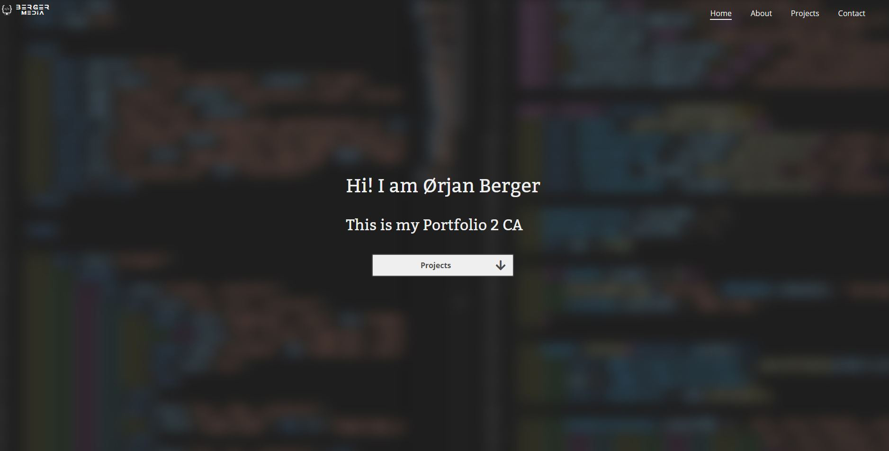

# Portfolio-2-CA by Ørjan Grøttvedt Berger



For this project we were tasked with creating a personal portfolio webpage that list 3 projects as cards.

## Description

The cards for the projects had to have a screenshot of the project and a link to the GutHub repo for that project. I choose to use a design that I have used for my personal portfolio and adapt that to this delivery.

## Built With

- [sass](https://sass-lang.com/)
- [Bootstrap](https://getbootstrap.com)
- HTML
- JavaScript

## Getting Started

### Installing

1. Clone the repo:

```bash
git clone git@github.com:oerjanberger/Portfolio-2-CA.git
```

2. Install Live Sass Compiler extensions:
Search for 
```
Live Sass Compiler 
```
in extension window
### Running

To run the app locally:

- Add the extension `Live server`
- Right click `index.html` and choose `open with Live server`

## Contributing

Make sure to open a pull request so code can be reviewed.

## Contact

[My LinkedIn page]((https://www.linkedin.com/in/%C3%B8rjan-berger-80a05889/)
